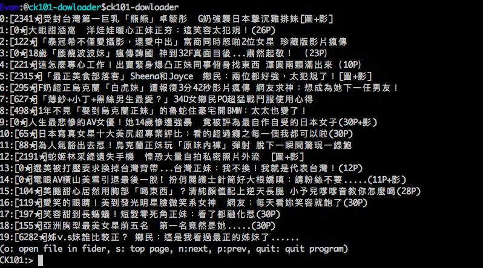

ck101-downloader 卡提諾圖片下載器
======================
[](https://raw.githubusercontent.com/kkdai/ck101-downloader/master/LICENSE) [](https://travis-ci.org/kkdai/ck101-downloader) 


`ck101-downloader`是一個小的console app，可以瀏覽[卡提諾](http://ck101.com)的[熱議美女](http://ck101.com/forum-3285-1.html)版面．

這個程式主要是透過[Photomgr](http://github.com/kkdai/photomgr)來讀取資料，該模組有支援更多的網站．

他可以透過console mode去瀏覽主要標題，並且指定哪些文章可以下載裡面的所有圖片到你的電腦中．


安裝
--------------

    go get -u -x github.com/kkdai/ck101-downloader

使用
---------------------

    ck101-downloader  

所有的圖片會安裝到 `USERS/Pictures/ck101` 並且會依照文章的標題分開不同的資料夾．

如果你是Windows使用者，他會自動存取到你的使用者資料夾的圖片之中．


選項
---------------

- `-w` 選定下載同步的執行序列個數，預設是10


交互指令
---------------

目前支援所有的指令如下:

- `n`: 顯示下一頁的資料.
- `p`: 顯示前一頁的資料.
- `o`: 打開目前的資料夾.
- `d` number: 下載該文章的所有圖片到你的電腦中.
- `quit`: 離開目前程式.

範例
---------------

簡單的範例透過設定同步10個下載序列來瀏覽.

```
//Run app.
ck101-downloader -w=10
        
0:[2341★]受封台灣第一巨乳「熊熊」卓毓彤  G奶強襲日本擊沉雞排妹[圖+影]
1:[0★]大眼甜酒窩　洋娃娃暖心正妹正夯：這笑容太犯規！(26P)
2:[122★]「泰冠希不僅愛攝影，還愛中出」富商同時怒啪2位女星 珍藏版影片瘋傳
3:[0★]18歲「腰瘦波波妹」瘋傳韓國 神到32F真面目後...肅然起敬！ （23P）
4:[221★]這怎麼專心工作！出賣緊身爆凸正妹同事俯身找東西 渾圓兩顆滿出來（10P）
5:[2315★]「最正美食部落客」Sheena和Joyce  鄉民：兩位都好強，太犯規了！[圖+影]
....
(o: open file in fider, s: top page, n:next, p:prev, quit: quit program)
CK101:> _

//Download index [5].
d 5
    
//quit application
quit
```
     


Snapshot
---------------




Inspired
---------------

This project inspired from [https://github.com/tzangms/iloveck101](https://github.com/tzangms/iloveck101). And I refer those implements as follow:

- Photo download and CLI: [https://github.com/lazywei/iloveck101](https://github.com/lazywei/iloveck101)


Contribute
---------------

Please open up an issue on GitHub before you put a lot efforts on pull request.
The code submitting to PR must be filtered with `gofmt`


廣告
---------------

如果你喜歡這個App，請考慮以下方式贊助我

- 按下一個"github Star"

感謝...

想要iOS的版本？
---------------

這裡有簡單的版本可以下載並且自己安裝 [PhotoViewer](https://github.com/kkdai/PhotoViewer)

Project52
---------------

It is one of my [project 52](https://github.com/kkdai/project52).


License
---------------

This package is licensed under MIT license. See LICENSE for details.
